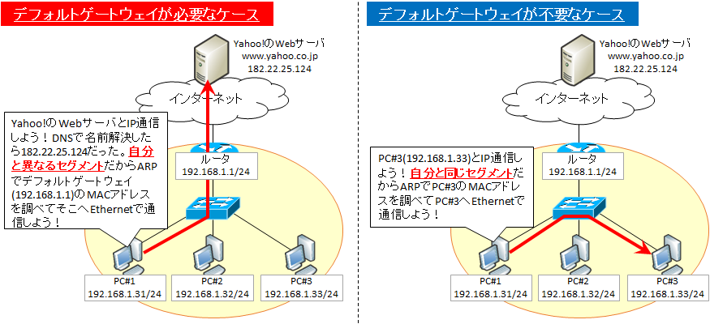

## 2023/04/07 仮想マシンにおけるネットワークの知識
添削で構成図を書いてほしいと言われた．\
vswitch(仮想スイッチ)を使って内部ネットワーク敵に動作させているので，視覚的に内容を理解できるようにとのこと．
***
### vswitch
vswitchとは，コンピュータの中に作られた2次元スイッチのこと．\
仮想スイッチは仮想マシン同士が通信するとき、あるいは仮想マシンと現実の世界のコンピュータが通信するときに使う．
### NAT(Network Address Translation)
LANに接続された端末からインターネットに接続する際に，プライベートIPアドレスを自動的に外部ネットワークで使用できるグローバルIPアドレスに変換する機能．
***
### IPアドレス
IPアドレスは，スマホやPCなどのネットワーク機器に割り当てられるインターネット上の住所のような存在である．\
インターネットでページを閲覧したり，メールの送受信を行うには，送信元と送信先を識別可能でなければならない．\
この識別に使われる番号がIPアドレスである．\
IPアドレスは，グローバルIPアドレスと，ローカルIPアドレスの２種類が存在する．
### グローバルIPアドレス
全世界で通用するアドレスで，世界でただひとつ，インターネットに接続する際に割り当てられるIPアドレスである．\
グローバルIPアドレスは特定の国や地域に属さない「ICANN」という組織によって世界的に管理されており，\
ICANNから日本の管理組織であるJPNICに割り振られ，そこからインターネット・サービス・プロバイダ（以下ISP）を経由して\
利用ユーザーへと割り振られている。そのため，利用ユーザーがISPと契約すると，ISPに割り当てられたIPアドレスのなかから\
PCやルーターが接続した際に通信が重複しないよう割り振られるため、同じグローバルIPアドレスが存在することはない．
#### プライベートIPアドレス
別名ローカルIPアドレスとも呼ばれる．グローバルIPアドレスとは違い，そのネットワーク内で識別できれば良いので，\
ほかのネットワークでは同じ番号が使われている可能性がある．\
#### 1. 番号域
IPアドレスは，数字3桁が4つにわかれているが，この3桁の数字は0～255までと決まっている．\
プライベートIPアドレスとして使っていいことになっているのが，以下のものとなる．
* 10.0.0.0～10.255.255.255　　　アドレス数：約1677万
    * クラスAと呼ばれる番号域．大規模ネットワーク向け．
* 172.16.0.0～172.31.255.255　　アドレス数：約104万
    * クラスBと呼ばれる番号域．中規模ネットワーク向け．
* 192.168.0.0～192.168.255.255　アドレス数：約6万
    * クラスCと呼ばれる番号域．小規模ネットワーク向け．

一般的に,プライベートIPアドレスは 192.168.から始まる．
#### 2. ネットワーク部とホスト部
サブネットマスクはIPアドレスのどこまでがネットワーク部でホスト部なのかルールを制定する．\
例として，サブネットマスクを255.255.255.0と定義する．\
192.168.1.11 というIPアドレスがある場合，**192.168.1** がネットワーク部，**11** がホスト部になる．
#### 3. ホスト部の数字割り当て
ホスト部の数字は0～255までである．ただし，0と255は特殊な数字であるため，ネットワーク機器に割り当てることができない．
* 0
    * **ネットワークアドレス**といい，例えば 192.168.1.0というのはネットワーク自体を示す時に使う．別名で**セグメント**とも呼ばれる．
* 255
    * **ブロードキャストアドレス**といい，あるセグメントに接続されている全てのホストにパケットを送信するためのアドレス．
#### 3. CIDR(サイダー)表記
IPアドレスにおいて，どこまでがネットワーク部であるのかを示す表記．\
**(例) 192.168.1.0/24**\
先頭24bitがネットワーク部であることを示す．IPアドレスは，全体で32bitであり，8bitずつ4ブロックに分かれている．\
つまり，192.168.1がネットワーク部であり，これはサブネットマスク255.255.255.0 とも同じ意味である．
### グローバルIPとプライベートIPのつながり
家族で共用のWi-Fiを使用するケース.この場合，グローバルIPアドレスが割り振られるのはWi-Fiルーターで，そこに接続するスマホやPC，\
家庭用ゲーム機などにはプライベートIPアドレスが設定される．これにより各機器はルーターを介してインターネットに接続できる．\
尚，自動的にプライベートIP(動的IP)が割り振られるのは，ルータが，**DHCP**という機能を備えているためである．\
ルータは，外のネットワークとの出入口であるため，**デフォルトゲートウェイ**という．
### 動的IPと固定IP
通常ISPから割り当てられるのは動的タイプで，固定タイプはオプションになっていることが多い．
* 動的IP\
インターネットに接続するたびに、ISPから新たなIPアドレスが自動的に割り振られるのが動的（可変）IPアドレスで、普段スマホやPCなどを\
利用するときに割り当てられるのがこちらのタイプとなる。一定時間が経過したり、ネットを切断するたびに番号が変更される。
* 固定IP\
一方、常に同じIPアドレスで接続するケースに対応したものが固定（不変）IPアドレス。\
会社内のシステムなど特定の許可した人（機器）しか通信できないよう設定する場合は、接続のたびにIPアドレスが変わってしまっては、\
どこからのアクセスか特定できない。接続が許可された人であることを特定するために固定IPアドレスが必要になる．
### デフォルトゲートウェイ
デフォルトゲートウェイとは，『宛先IPアドレスが，自PCに設定されているIPアドレスが所属するネットワークアドレスとは異なる場合に，パケットをどこに転送すればよいかを設定するもの』である．\
  

### DHCP
コンピュータがネットワークに接続する際に，自動的にIPアドレスを割り振るプロトコルである．
### インターネットに接続する仕組み
> https://mo-gu-mo-gu.com/how-internet-connect-wifi-and-cellular/  

> https://rank-king.jp/article/14356

> https://curio-shiki.com/blog/support/router-modem-wifi-wiki