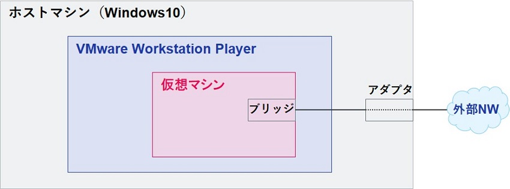
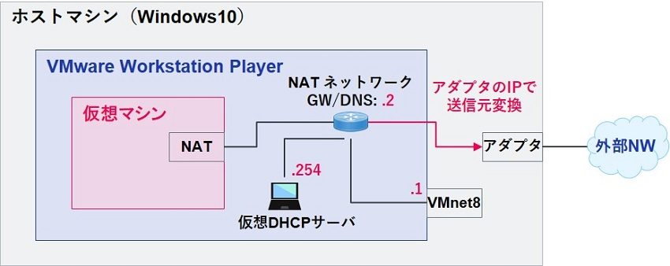
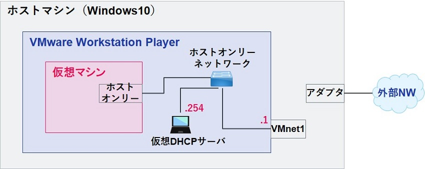

## 2023/04/07 VMware Workstation Playerのネットワーク設定
### ① ブリッジ
**ブリッジ**は、VMware Workstation Player が動作しているホストマシンのアダプタが接続するネットワークに仮想マシンのアダプタを直接接続します。

* 仮想マシンから外部ネットワークへの通信
    * ホストマシンのアダプタを通して外部ネットワークと通信
* 外部ネットワークから仮想マシンへの通信
    * ホストマシンのアダプタを介して直接仮想マシンと通信

**ブリッジ先のアダプタは全て共通であり、仮想マシン別に変えることはできない。**

  
### ② NAT
**NAT**は、VMware Workstation Player の仮想NATネットワークに接続するアダプタである。
* 仮想マシンから外部ネットワークへの通信
    * ホストマシンのアダプタを介して送信元 NAT されることで通信可能
* 外部ネットワークから仮想マシンへの通信
    * 不可

  

### ③ホストオンリー
**ホストオンリー**は、VMware Workstation Player の仮想 ホストオンリーネットワークに接続するアダプタである。
* 仮想マシンから外部ネットワークへの通信
    * 不可
* 外部ネットワークから仮想マシンへの通信
    * 不可

  

### ④LANセグメント